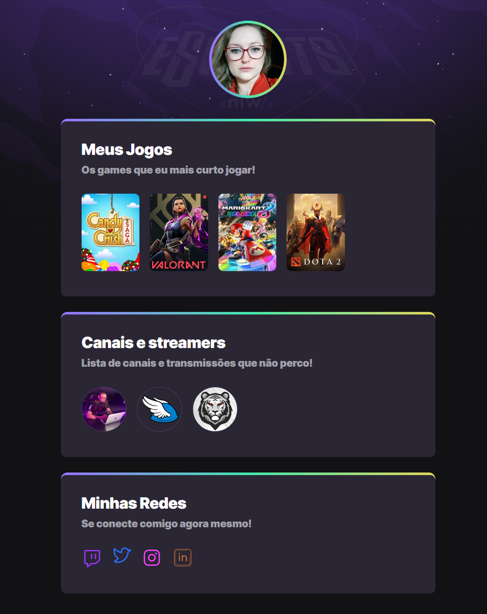

# NLW eSports

>Trilha Explorer

Projeto construído no evento Next Level Week da Rocketseat.

[🔗Clique aqui para acessar](https://adrianabeneduzzi.github.io/nlw-esports-explorer/)

## 💻 Tecnologias

- HTML
- CSS
- Git e GitHub

## 💡 O que aprendi com o NLW eSports

A estruturar desde o inicio com HTML,adicionado estilo e animações com CSS, com atenção a cada detalhe no desenvolvimento do projeto.

## ❣️ Contato

adrianafbeneduzzi@gmail.com